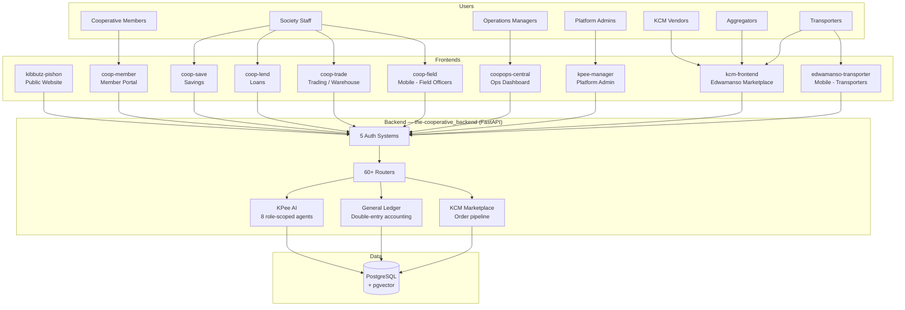
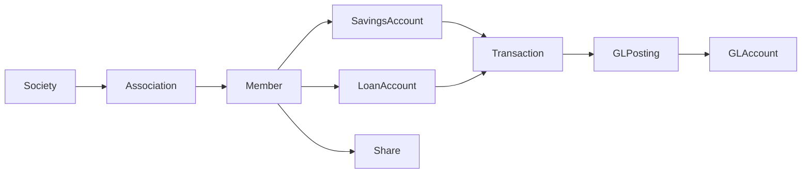
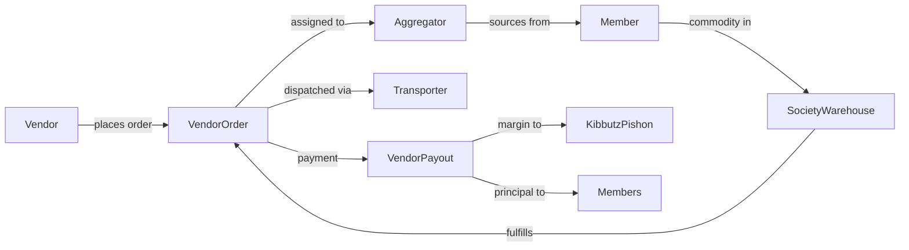

# KPee — Kibbutz Pishon Economic Engine

> A multi-tenant SaaS platform running cooperative banking, commodity trading, and a role-scoped AI agent system for agricultural cooperatives in Ghana.

> **About this repository** — This is a public architecture overview. The production source code is private. Everything here is documentation: diagrams, design write-ups, and screenshots of a system that's been in production since 2022.

**Status**: Live in production since 2022 · Active development · Sole engineer: [@Afrifa518](https://github.com/Afrifa518)

---

## What is KPee?

KPee is the platform operated by [Kibbutz Pishon Ltd](https://kibbutzpishon.com), an agritech company in Ghana that builds and runs farmer cooperatives and operates **Edwamanso** — a digital commodity trading marketplace connecting cooperatives, vendors, aggregators, transporters, and warehouses.

The platform has to serve ten distinct user types (members, field officers, savings officers, loan officers, trade officers, operations managers, platform admins, vendors, aggregators, transporters) from a single coherent backend, with strict data isolation between them, full double-entry accounting, and an AI assistant that knows which data each user is allowed to see.

I designed and built the whole thing from scratch as a one-person engineering team.

---

## At a glance

| Metric | Value |
|---|---|
| Architecture | Single FastAPI backend · 10 frontend apps (web + mobile) · 1 PostgreSQL database |
| Backend modules | 60+ FastAPI routers |
| Distinct auth systems | 5 (cooperative users, vendors, aggregators, transporters, platform admins) |
| User-facing apps | 7 web portals · 2 React Native mobile apps · 1 public website |
| AI agents | 8 role-specific agents with multi-provider LLM routing |
| Engineering team | 1 person, end to end |

---

## System architecture

---

## The apps

| App | Stack | Who uses it |
|---|---|---|
| **kibbutz-pishon** | Vite + React (JSX) + Tailwind + Radix | Public — marketing / info |
| **coop-member** | Vite + React + MUI + deck.gl + Google Maps | Cooperative members — balances, loans, shares, geo |
| **coop-save** | Vite + React + MUI | Savings officers — deposits, withdrawals, reports |
| **coop-lend** | Vite + React + MUI | Credit officers — loan lifecycle |
| **coop-trade** | Vite + React + MUI | Warehouse / trade officers — commodity intake, sales |
| **coopops-central** | Vite + React + MUI | Society managers — operations dashboard, subscriptions |
| **kpee-manager** | Vite + React + TypeScript + MUI + Radix | Kibbutz Pishon platform admins |
| **kcm-frontend** | Vite + React + TypeScript + HeroUI + Tailwind | Edwamanso vendors, aggregators, transporters, partners |
| **coop-field** | Expo / React Native + expo-router | Field facilitators (mobile) — savings/loan data capture |
| **edwamanso-transporter** | Expo / React Native + TypeScript | Transporters (mobile) — pickup, dispatch, tracking |

---

## Backend highlights

The backend is a single FastAPI application (`the-cooperative_backend`). The domain layer has **60+ routers** all sharing one SQLAlchemy model file and one PostgreSQL database.

**Core domains**:
- Cooperative banking — savings, loans, shares, societies, associations, members
- General Ledger — accounts, transactions, postings, invariant guards, settlement
- KCM marketplace — commodities, vendor orders, aggregator onboarding + KYC, transporters, warehouses, payouts
- Public APIs — public commodities feed, public Edwamanso catalog, Kibbutz media
- KPee AI — role-scoped agents, multi-provider LLM routing, knowledge base

**5 distinct authentication systems** with role-scoped permissions:
1. `auth.py` — cooperative users (staff of cooperatives)
2. `vendor_auth.py` — KCM marketplace vendors
3. `aggregator_auth.py` — KCM aggregators
4. `transporter_auth.py` — KCM transporters
5. `kpee_admin_auth.py` — Kibbutz Pishon platform admins

These are isolated behind what I call an **analytical firewall** — a role-context layer that ensures no agent, no endpoint, and no AI retrieval can return data across the boundary of an actor type.

---

## Domain model highlights

### Cooperative banking

Members belong to associations which belong to societies (the actual cooperative). Every member-level transaction produces a **General Ledger posting** with double-entry semantics and invariant guards preventing orphaned or unbalanced entries.

### KCM / Edwamanso marketplace

The marketplace is the company's primary revenue engine. Kibbutz Pishon's society warehouses act as sellers of record. Vendors pay the society; members are paid **10–20% below** what the vendor paid. That margin is the trading fee, realised through `SocietyWarehouseTransactions` and a `VendorTrade` financial model.

---

## The Cash Partnership system (in progress — April 2026)

The newest feature: allow **small investors to pool micro-amounts** (minimum ₵10) into specific commodity trade models. When a pool fills, it's routed through the normal KCM order pipeline. Margins are realised and distributed proportionally to each partner.

Six-phase rollout:
1. Backend models + Alembic migrations
2. Backend admin APIs (`kpee-manager`)
3. Backend partner APIs (partner dashboard)
4. `kpee-manager` admin UI for trading periods and trade models
5. `kcm-frontend` partner dashboard
6. Notifications, ledger integration, polish

This sits alongside the existing `KcmInvestment` system (1-to-1 admin-linked investments) without touching it.

---

## Deployment

| Component | Where it runs |
|---|---|
| Backend | Docker + Nginx reverse proxy; also configured for serverless (Mangum handler + `vercel.json`) |
| All web frontends | Vercel |
| Mobile apps | Expo EAS builds (Android + iOS) |
| Database | PostgreSQL (managed) |
| CORS | Pinned to `*.kibbutzpishon.com` + localhost dev ports |

---

## What this project demonstrates

- **Multi-tenant SaaS architecture at production scale** — single backend, isolated data, role-scoped permissions across 5 distinct auth systems, 10 frontends.
- **Real financial correctness** — General Ledger with double-entry invariants; errors have accounting consequences, not just UI consequences.
- **Monorepo discipline** — 10 apps with three different frontend stacks (JSX + MUI; TypeScript + Tailwind + Radix; Expo + React Native) sharing consistent API conventions.
- **AI as a product feature, not a demo** — role-scoped agents with permission-aware data retrieval, multi-provider fallback, and an analytical firewall (see [kpee-ai-overview](https://github.com/Afrifa518/kpee-ai-overview)).
- **Full ownership** — architecture, implementation, DevOps, release, and incident response, sole engineer from day zero.

---

## Contact

**Afrifa Yaw Ankamah** — CTO, Kibbutz Pishon Ltd
📧 afrifabusiness518@gmail.com · 📱 +233 50 968 7490 · 📍 Accra, Ghana

Open to remote full-stack and backend engineering roles. [github.com/Afrifa518](https://github.com/Afrifa518)
